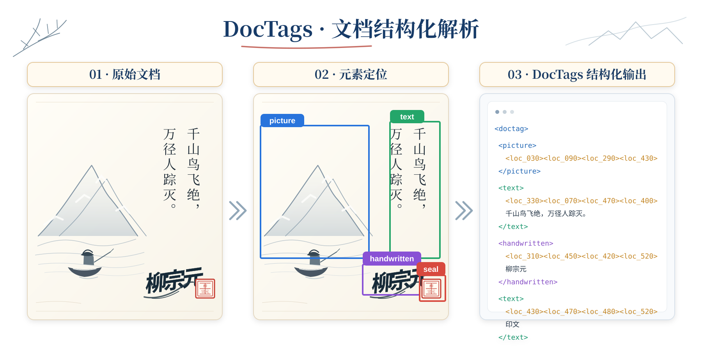

---
hide:
  - toc
shanshui_scene: 7
---

<section class="mv-showcase-v18" aria-labelledby="mv-showcase-title">
  <header class="mv-showcase-v18__intro">
    
模型展示 · MODEL SHOWCASE

    <h1 id="mv-showcase-title">自研模型展示</h1>
    
探索文档理解与视频理解的研究成果。

  </header>

  

    <article class="mv-showcase-v18__card mv-showcase-v18__card--doc" aria-labelledby="mv-showcase-doc-title">
      <figure class="mv-showcase-v18__cover">
        
      </figure>
      

        文档理解 · DocTags
        <h2 id="mv-showcase-doc-title">复杂文档结构化解析</h2>
        
文档版面、文本、表格、印章、手写与阅读顺序等结构化解析。

        <a class="mv-showcase-v18__primary" href="https://multimodal-vision-ai-mvai-doctags-webgpu.static.hf.space/" target="_blank" rel="noopener noreferrer">在线体验 ↗</a>
      

    </article>

    <article class="mv-showcase-v18__card mv-showcase-v18__card--video" aria-labelledby="mv-showcase-video-title">
      

        ▶
        视频行为理解
        打电话 · 玩手机 · 吃东西
      

      

        视觉理解 · 研究方向
        <h2 id="mv-showcase-video-title">视频行为识别模型</h2>
        
面向视频中的人物动作识别与分析。

        
方案展示，暂未开放实时模型体验。

      

    </article>
  

</section>

??? info "其他实验入口与技术说明"
    [站内 WebGPU 实验](doctags-browser/README.md) · [Kaggle 免费 GPU](doctags-kaggle/README.md) · [文档理解项目](document-ai/README.md)

[文档理解](document-ai/README.md) · [视觉理解](vision-ai/README.md) · [学生作品与提交指南](student-work/README.md)
{: .mv-showcase-v18__footer }
